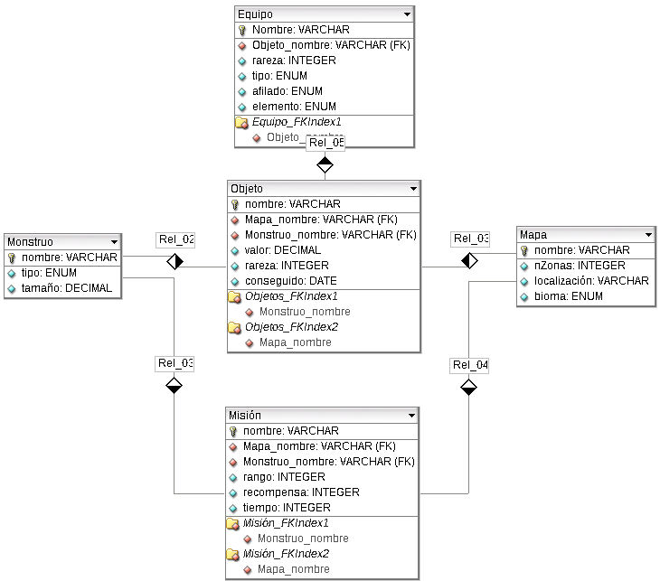

# Proyecto DDL y DML
## Esquema relacional

### Tablas
#### Monstruo
| Campo | Tipo de datos | Restricciones |
|:-----:|:------------:|:------------:|
| nombre | varchar2(20) | clave primaria, debe estar compuesto solo por letras y cada palabra tiene que empezar por mayúsculas (ej: Zorah Magdaros) |
| tipo | varchar2(20)   | enum |
| tamaño | decimal |  |
#### Mapa
| Campo | Tipo de datos | Restricciones |
|:-----:|:------------:|:------------:|
| nombre | varchar2(20) | clave primaria |
| nZonas | int | entre 1 y 20 , obligatorio|
| bioma | varchar2(20) | enum |
#### Objeto
| Campo | Tipo de datos | Restricciones |
|:-----:|:------------:|:------------:|
| nombre | varchar2(20) | clave primaria |
| Mapa_nombre | varchar2(20) | clave ajena |
| Monstruo_nombre | varchar2(20) | clave ajena |
| valor | decimal | entre 0 y 10000 |
| rareza | int | entre 1 y 10 |
| conseguido | fecha | entre 2010-01-01 y hoy |
#### Misión
| Campo | Tipo de datos | Restricciones |
|:-----:|:------------:|:------------:|
| nombre | varchar2(20) | clave primaria |
| Mapa_nombre | varchar2(20) | clave ajena |
| Monstruo_nombre | varchar2(20) | clave ajena |
| rango | int | entre 1 y 10 |
| descripcion | varchar2(100) | Única |
| recompensa | decimal | entre 0 y 10000 |
| tiempo | int | menor que 50,  por defecto 30 |
#### Equipo
| Campo | Tipo de datos | Restricciones |
|:-----:|:------------:|:------------:|
| nombre | varchar2(20) | clave primaria |
| Objeto_nombre | varchar2(20) | clave ajena |
| rareza | int | entre 1 y 10 |
| tipo | varchar2(20) | enum |
| elemento | varchar2(20) | enum |
| afilado | varchar2(20) | enum |

## Enunciado
Modificaciones sobre las tablas:
1. Añadir a la tabla Monstruo un un campo peso, de tipo decimal con 2 decimales.
2. modificar el campo para que sea de tipo varchar2, ya que no vamos a operar con el número.
3. Crear una restricción  que no permita que el peso sea negativo.
4. Desactiva la restricción e introduce un valor negativo
5. vuelve a activarla.
6. Eliminar la restricción
7. Eliminar la columna peso.

Consultas
1. Mostrar los nombres de todos los monstruos [SENCILLA]
2. Crear una vista que contenga el nombre de los objetos junto a su valor [VISTA]
3. Mostrar las piezas de equipamiento que se obtienen del monstruo "Fatalis Carmesi" [SUBCONSULTA]
4. Obtener el precio combinado de los objetos que se pueden obtener en "Selva Jurásica" [COMBINACIÓN DE TABLAS]
5. [INSERCIÓN DE REGISTROS]
6. En la tabla equipo, actualizar el afilado de los registros que tengan rareza superior a 4 y sean armas a: "Blanco" [MODIFICACION DE REGISTROS]
7. [BORRADO DE REGISTROS]
8. [GROUP BY]
9. [OUTER JOIN]
10. [OPERADORES DE CONJUNTO]
11. [SUBCONSULTAS CORRELACIONADAS]
12. [MEZCLA DE LOS ANTERIORES]
